# CYLTFR App — Application Architecture Documentation

> **Check Your Long Term Flood Risk — Front-End Application**
> Version 5.6.0 | Node.js 22+ | Hapi.js 21

---

## 1. Executive Summary

The CYLTFR App is the public-facing web application for the UK Government's **Check Your Long Term Flood Risk** service, operated by DEFRA (Department for Environment, Food & Rural Affairs). It allows members of the public to enter their postcode, select an address in England, and receive an assessment of their long-term flood risk across four hazard types: Rivers & Sea, Surface Water, Groundwater, and Reservoirs.

The application is built as a server-rendered Node.js application using the **Hapi.js** framework, with **Nunjucks** templates and the **GOV.UK Frontend** design system. It acts as an orchestration layer — it does not hold flood data itself, instead calling a suite of downstream APIs (the internal `cyltfr-service`, Ordnance Survey APIs, and a flood warnings service) to assemble the data needed to render each page.

The application sits within a wider DEFRA service ecosystem:
- [`cyltfr-service`](https://github.com/DEFRA/cyltfr-service) — the backend spatial data API
- [`cyltfr-data`](https://github.com/DEFRA/cyltfr-data) — the geospatial data pipeline
- [`cyltfr-admin`](https://github.com/DEFRA/cyltfr-admin) — internal administration tooling

---

## 2. Technology Stack

| Category | Technology | Version |
|---|---|---|
| Language | Node.js | ≥ 22.14.0 |
| Web Framework | Hapi.js (`@hapi/hapi`) | ^21.4.4 |
| Template Engine | Nunjucks | ^3.2.4 |
| UI Framework | GOV.UK Frontend | ^6.0.0 |
| CSS Pre-processor | Sass | ^1.94.2 |
| JS Bundler | Webpack | ^5.103.0 |
| Session Management | @hapi/yar | ^11.0.3 |
| Cache (in-memory) | @hapi/catbox-memory | ^6.0.2 |
| Cache (distributed) | @hapi/catbox-redis | 7.0.2 |
| HTTP Client | @hapi/wreck | ^18.1.0 |
| Input Validation | Joi | ^18.0.2 |
| Logging | hapi-pino | ^13.0.0 |
| Rate Limiting | hapi-rate-limit | ^8.0.0 |
| Proxy (HTTP) | @hapi/h2o2 | ^10.0.4 |
| Static Assets | @hapi/inert | ^7.1.0 |
| Bot Protection | FriendlyCaptcha (`@friendlycaptcha/sdk`) | ^0.1.33 |
| Error Monitoring | Airbrake / Errbit (`@airbrake/node`) | ^2.1.9 |
| Map Layers | ESRI ArcGIS (`@arcgis/core`) | ^4.34.8 |
| Map Tiles | Ordnance Survey Maps API | — |
| Process Manager | PM2 | — |
| Tests | Jest | ^30.2.0 |
| Linting | ESLint + neostandard | ^9.39.2 |
| Container Base | defradigital/node | 2.5.3-node22.14.0 |

---

## 3. System Context

The diagram below shows the CYLTFR App in the context of its users and the external systems it interacts with.

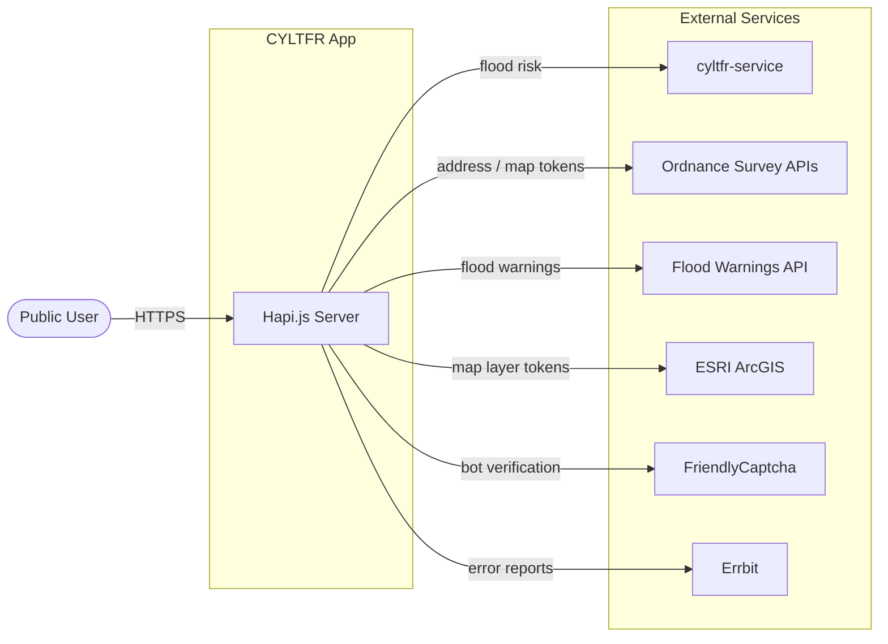

The app is a single server-rendered Node.js process. All external service calls are made server-side; the browser only communicates directly with external services for map tiles (after receiving tokens from the server).

---

## 4. Container Architecture

The CYLTFR App is deployed as a single Docker container. The diagram below shows the major runtime containers and their relationships.

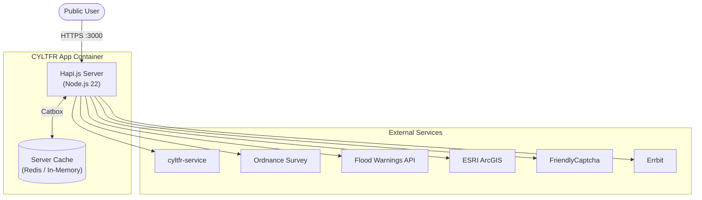

The server cache uses **Redis** in production (for shared state across PM2 worker processes) and an **in-memory** Catbox store in development and test. Session data is stored entirely in the cache; only a session ID cookie is sent to the browser.

---

## 5. Component Architecture

The diagram below breaks the Hapi.js server into its major internal layers and shows how they interact.

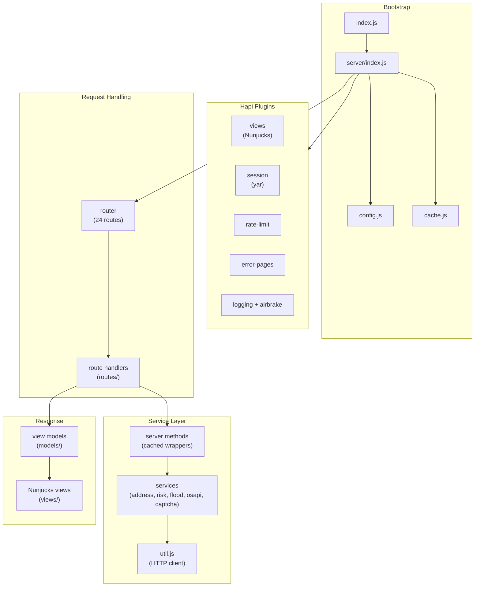

| Layer | Responsibility |
|---|---|
| **Bootstrap** | Loads `.env`, validates config with Joi, creates Hapi server, configures Catbox cache |
| **Hapi Plugins** | Cross-cutting concerns: templating, sessions, rate limiting, error pages, structured logging, error monitoring |
| **Request Handling** | Maps URL paths to handler functions; each handler is a standalone module in `routes/` |
| **Service Layer** | Server methods wrap service functions with a 100-second Catbox cache; services are thin HTTP clients using `util.js` / `@hapi/wreck` |
| **Response** | View models transform raw API data into view-ready objects; Nunjucks renders the final HTML using GOV.UK Frontend components |

---

## 6. Plugin Registration Order

Plugins are registered in this exact sequence in `server/index.js`. Order is significant — session depends on cache, error-pages must follow the router, and airbrake is conditional.

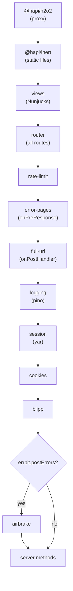

---

## 7. Request Flow — Postcode to Address List

The sequence below covers the first half of the user journey: entering a postcode through to seeing the address selector.

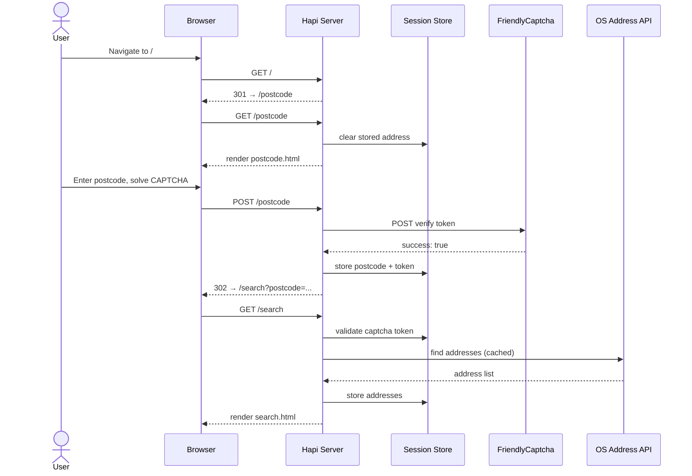

---

## 8. Request Flow — Address Selection to Risk Result

The second half of the journey: selecting an address and viewing the flood risk summary.

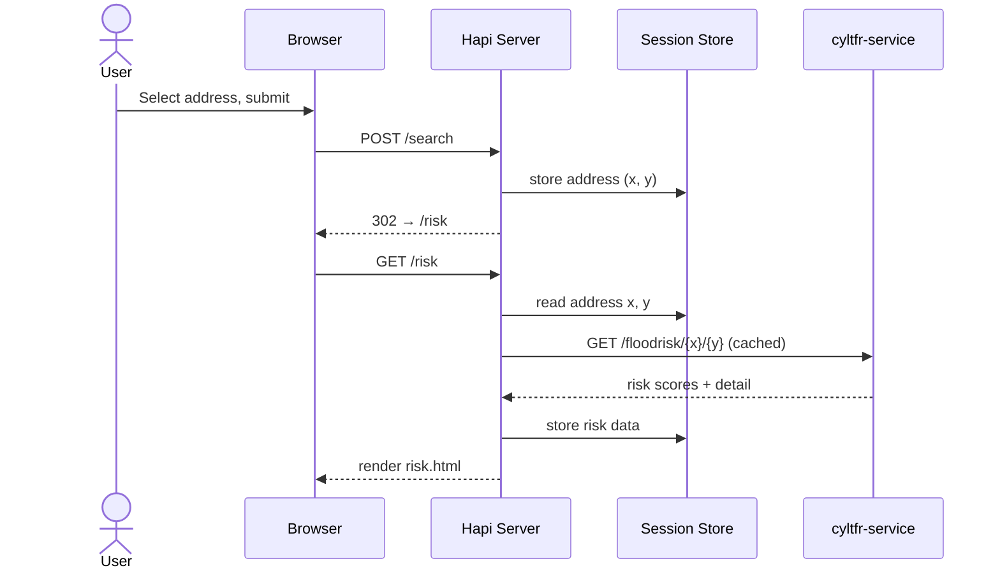

The `risk` session value is subsequently reused by the depth detail pages (`/rivers-and-sea-depth`, `/surface-water-depth`) to avoid re-fetching risk data.

---

## 9. Data Flow

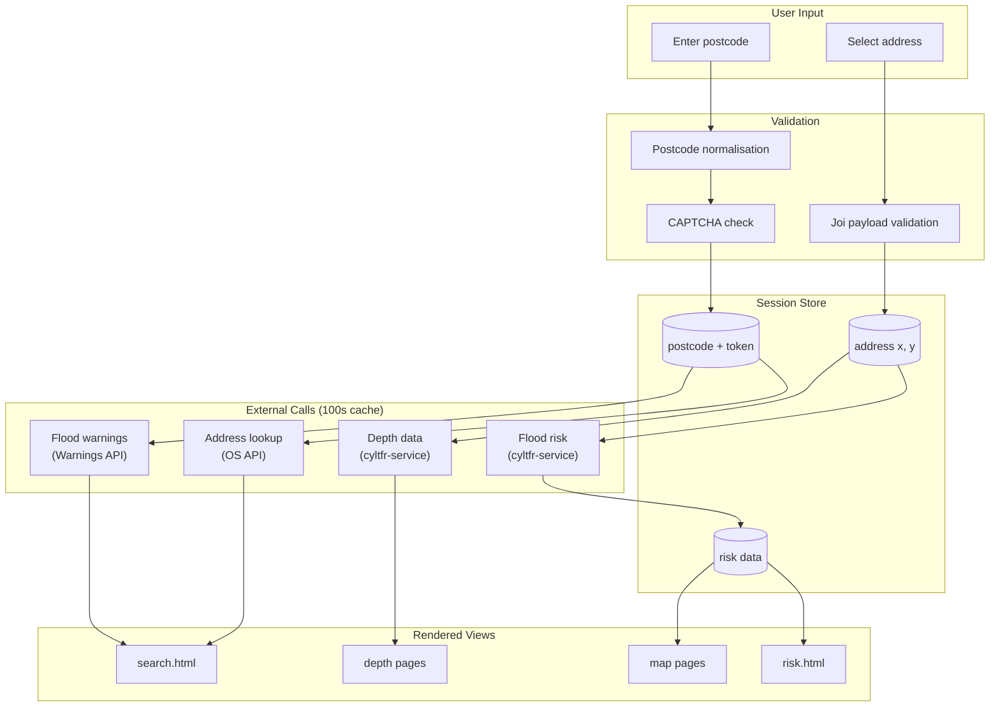

---

## 10. Caching Architecture

All calls to external APIs are routed through Hapi server methods, which provide transparent caching via Catbox.

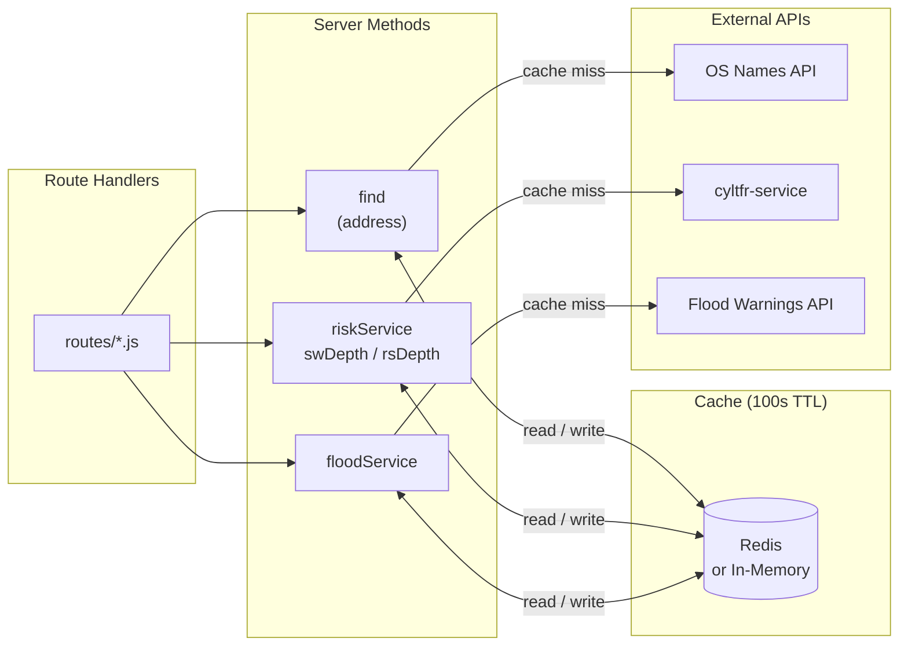

**TTL:** 100 seconds for all server method caches. Controlled by `CACHE_ENABLED` (set to `false` to disable entirely). The Redis backend is enabled by `REDIS_CACHE_ENABLED=true` and supports TLS via `REDIS_TLS=true`.

---

## 11. Interactive Map Architecture

The map page has a distinct flow involving server-fetched OAuth tokens that are embedded in the page for client-side use.

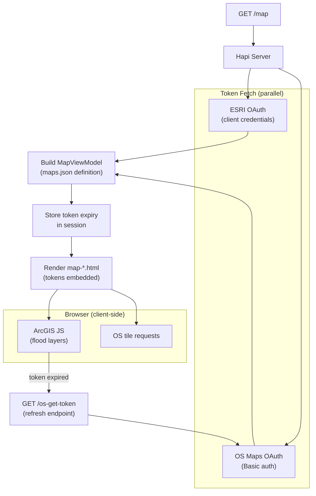

Map layer definitions (which layers to display per map type) are loaded from versioned JSON files at `server/models/definition/{DATA_VERSION}/maps.json`. The data version is set via the `DATA_VERSION` environment variable, allowing layer configuration changes without a code deployment.

---

## 12. Error Handling

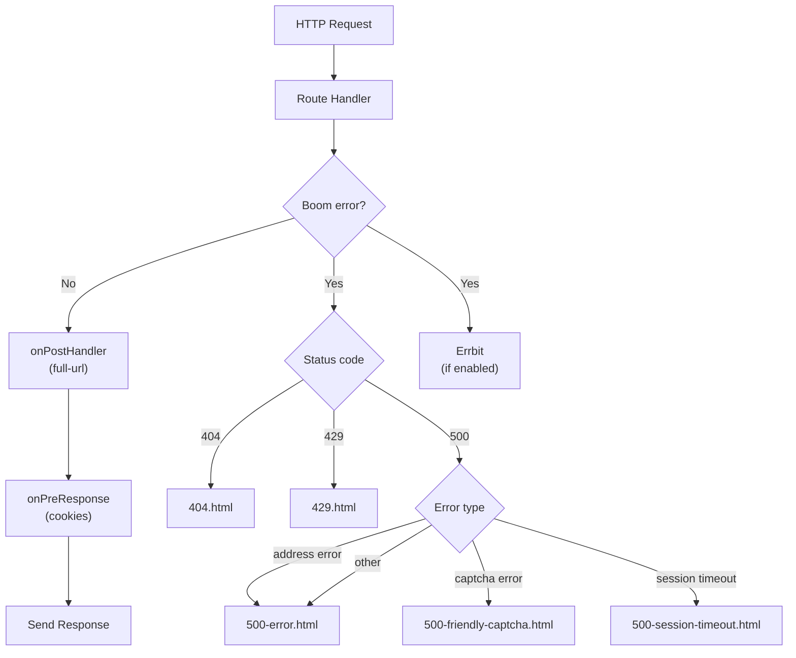

The `error-pages` plugin registers an `onPreResponse` lifecycle hook. Every Boom error is intercepted and mapped to a specific error template before the response is sent. The `airbrake` plugin listens to Hapi's `request` error channel and forwards all errors to Errbit independently.

---

## 13. Bot Protection Flow

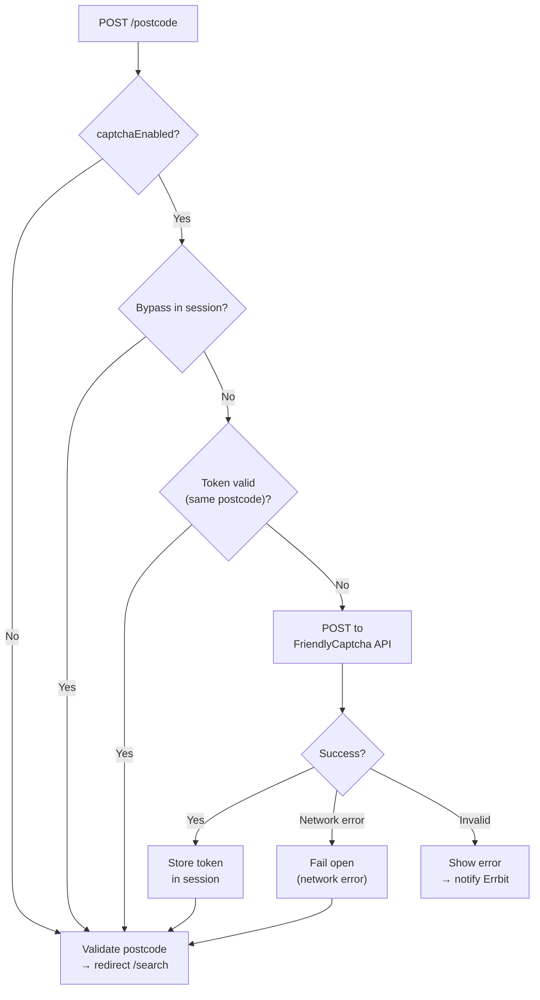

The token is stored in session and reused for the duration of the user journey, bounded by `SESSION_TIMEOUT` (default 10 minutes). The bypass mechanism (`FRIENDLY_CAPTCHA_BYPASS`) supports automated testing. If FriendlyCaptcha is unreachable due to a network error the application **fails open** to avoid blocking legitimate users.

---

## 14. Deployment Architecture

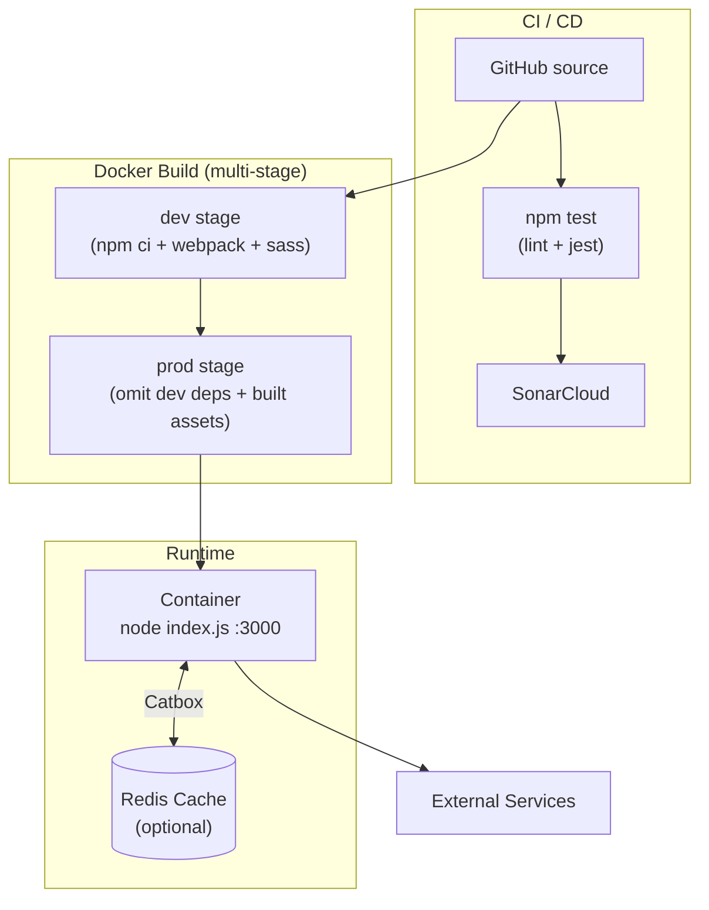

**Multi-stage Docker build:**
- **`development` stage** — installs all dependencies (including dev), runs `npm run build` to produce Webpack bundles and compiled CSS, includes AWS CLI and debugger port (9229).
- **`production` stage** — installs production dependencies only, copies server source and built assets from the `development` stage. Runs as non-root `node` user.

**Health check:** Container health is verified by `curl http://localhost:{PORT}/healthcheck` with a 5-second timeout.

**Process start:** In production the container runs `node index.js` directly. The `npm start` script uses PM2 with `config/pm2.json` for multi-process deployments outside of Docker.

---

## 15. Route Inventory

| Method | Path | Description |
|---|---|---|
| GET | `/` | Permanent redirect to `/postcode` |
| GET | `/postcode` | Postcode entry form |
| POST | `/postcode` | Validates postcode and captcha; redirects to `/search` |
| GET | `/search` | Address selector for given postcode |
| POST | `/search` | Stores selected address in session; redirects to `/risk` |
| GET | `/risk` | Flood risk summary page |
| GET | `/rivers-and-sea` | Rivers and sea flood risk detail |
| GET | `/rivers-and-sea-depth` | Rivers and sea depth data |
| GET | `/surface-water` | Surface water flood risk detail |
| GET | `/surface-water-depth` | Surface water depth data |
| GET | `/ground-water` | Groundwater detail |
| GET | `/reservoirs` | Reservoir flood risk detail |
| GET | `/map` | Interactive flood risk map (`?map=` selects layer) |
| GET | `/os-get-token` | Refreshes OS Maps OAuth token for client-side use |
| GET | `/risk-data` | Static: how to access flood risk data |
| GET | `/information-for-planning` | Static: planning guidance |
| GET | `/managing-flood-risk` | Static: managing flood risk |
| GET | `/england-only` | Non-England postcode redirect page |
| GET | `/feedback` | User feedback page |
| GET | `/cookies` | Cookie policy page |
| GET | `/privacy-notice` | Privacy notice page |
| GET | `/terms-and-conditions` | Terms and conditions page |
| GET | `/accessibility-statement` | Accessibility statement page |
| GET | `/os-terms` | Ordnance Survey terms page |
| GET | `/public/*` | Static assets served via `@hapi/inert` |
| GET | `/healthcheck` | Returns `"ok"` — used by container health check |

---

## 16. Configuration Management

All configuration is read from environment variables and validated at startup by a Joi schema in `server/config.js`. If required variables are missing or invalid the server will not start. Sensitive properties (API keys, secrets, passwords) are redacted from log output by `server/sanitise-log.js`.

| Group | Key Variables |
|---|---|
| Server | `RISK_APP_HOST`, `PORT`, `NODE_ENV` |
| Backend Services | `SERVICE_URL`, `FLOOD_WARNINGS_URL`, `FLOOD_RISK_URL` |
| Ordnance Survey | `OS_POSTCODE_URL`, `OS_MAPS_URL`, `OS_SEARCH_KEY`, `OS_MAPS_KEY`, `OS_MAPS_SECRET`, `OS_TOKEN_ENDPOINT` |
| ESRI ArcGIS | `ESRI_CLIENT_ID`, `ESRI_CLIENT_SECRET` |
| Session & Cookies | `COOKIE_PASSWORD` (min 32 chars), `SESSION_TIMEOUT` |
| Redis Cache | `REDIS_CACHE_ENABLED`, `REDIS_CACHE_HOST`, `REDIS_CACHE_PORT`, `REDIS_TLS` |
| Rate Limiting | `RATE_LIMIT_ENABLED`, `RATE_LIMIT_REQUESTS`, `RATE_LIMIT_EXPIRES_IN`, `RATE_LIMIT_WHITELIST` |
| FriendlyCaptcha | `FRIENDLY_CAPTCHA_ENABLED`, `FRIENDLY_CAPTCHA_SITE_KEY`, `FRIENDLY_CAPTCHA_SECRET_KEY`, `FRIENDLY_CAPTCHA_URL`, `FRIENDLY_CAPTCHA_BYPASS` |
| Error Monitoring | `ERRBIT_POST_ERRORS`, `ERRBIT_ENV`, `ERRBIT_KEY`, `ERRBIT_HOST` |
| Analytics | `G4_ANALYTICS_ACCOUNT`, `GTAG_MANAGER_ID` |
| Performance | `HTTP_TIMEOUT_MS`, `PERFORMANCE_LOGGING` |
| Testing / Simulation | `SIMULATE_ADDRESS_SERVICE`, `DATA_VERSION`, `IS_LOCAL_ENV` |

---

## 17. Client-Side Architecture

The client-side code is built using Webpack (output to `server/public/build/`) and consists of:

- **GOV.UK Frontend** — Loaded as a JS module for accessible, GOV.UK Design System compliant UI components.
- **ESRI ArcGIS JS API (`@arcgis/core`)** — Used on `/map` for interactive flood risk map rendering. ESRI and OS tokens are injected server-side into the page config object and used to initialise the map client-side.
- **FriendlyCaptcha SDK (`@friendlycaptcha/sdk`)** — Injected on `/postcode` when `FRIENDLY_CAPTCHA_ENABLED=true`.
- **Custom SASS** — Styles compiled from `client/sass/` and `node_modules/govuk-frontend/`, output to `server/public/build/`.

Static assets are served at `/assets` via `@hapi/inert`.

---

## 18. Testing Approach

| Type | Tool | Scope |
|---|---|---|
| Unit / Integration | Jest | Service functions, route handlers, view models, plugins, config validation |
| Linting | ESLint + neostandard | All JS files |
| Dependency audit | `npm audit` | Production dependencies only (run as part of `npm test`) |
| Static analysis | SonarCloud | Connected via `sonar-project.properties` |
| Simulated data | JSON fixtures under `routes/simulated/data/` | Address and warning service simulation when `SIMULATE_ADDRESS_SERVICE=true` |

Test files are co-located with source in `__tests__/` directories. Jest manual mocks live in `__mocks__/` directories alongside the modules they replace.

---

## 19. Key Design Decisions

| Decision | Rationale |
|---|---|
| **Hapi.js over Express** | Plugin-based architecture with first-class server methods, Catbox caching, and Joi validation; used consistently across DEFRA services. |
| **External calls as server methods** | Wrapping service calls as Hapi server methods enables transparent, configurable caching without cluttering route handlers. |
| **Dual cache backends** | Redis is used in production for shared cache across PM2 worker processes. In-memory Catbox removes Redis as a local dependency in development and test. |
| **Session stored server-side** | `maxCookieSize: 0` forces all session data into the cache store; only a session ID cookie reaches the browser. This prevents session data exposure and keeps cookie payloads minimal. |
| **FriendlyCaptcha token reuse** | The captcha token is validated once and stored in session for the duration of the user journey, avoiding repeated external verification calls. |
| **Fail-open for captcha network errors** | If FriendlyCaptcha is unreachable, the application proceeds rather than blocking legitimate users. Errors are reported to Errbit. |
| **Versioned map definitions** | Map layer configuration is loaded from `server/models/definition/{DATA_VERSION}/maps.json`, allowing data version changes via environment variable without a code deployment. |
| **Non-England postcode handling** | NI, Scottish, and Welsh postcodes are detected early and redirected to an informational page — the OS address API and risk data only cover England. |
| **GOV.UK Frontend** | Ensures compliance with the GOV.UK Design System and WCAG 2.1 accessibility requirements for public-sector digital services. |
